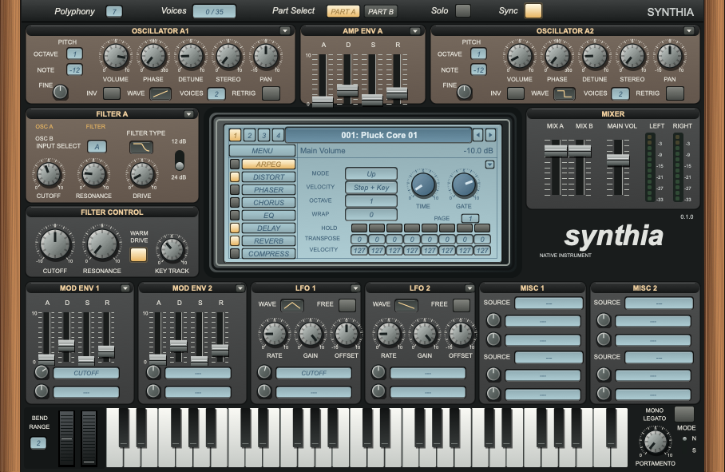
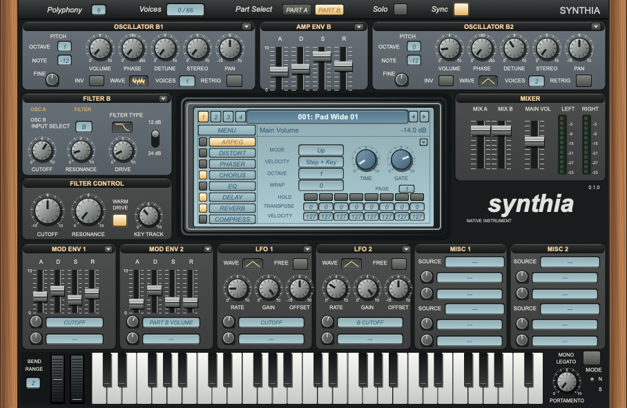
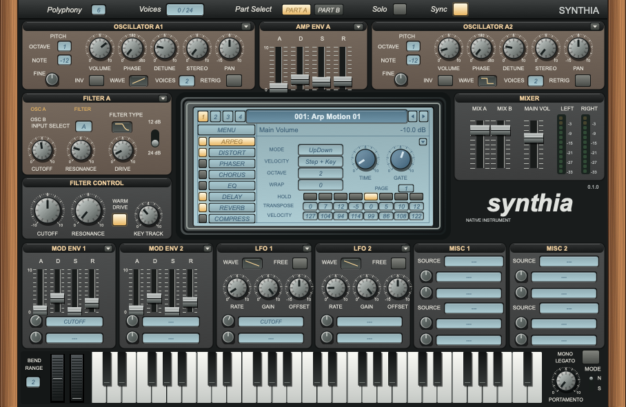
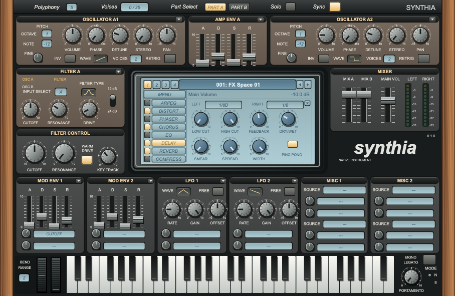

# Synthia interface guide

These are unmodified captures of Synthia 0.1.0 Standalone, taken on 2026-10-09 at the native 908 × 591 size. The interface is drawn from owned code and uses the Synthia identity. The classic Sylenth1 reference guides the recreation; these images document Synthia, and do not establish identical pixels or sound. See the [product contract](../SPEC.md#1-current-release-contract) for the separate visual, behavior, audio, and persistence requirements.

## Part A: start with a pluck

Preset: [Pluck Core 01](<../presets/factory/Pluck/PL - Pluck Core 01.SynthiaPreset>). **Part Select** at the top chooses A or B. The selected part's two oscillators flank its amplitude envelope; the left filter below them shapes that part's sound. **Filter Control** changes the shared filter settings, while **Mixer** on the right balances A, B, and the master output.

The lower row contains two modulation envelopes, two LFOs, and miscellaneous source/destination routes. The keyboard and pitch/modulation wheels run along the bottom; bend range sits on the left and mono/legato and portamento sit on the right.

## Part B: edit the second part

Preset: [Pad Wide 01](<../presets/factory/Pad/PD - Pad Wide 01.SynthiaPreset>). **PART B** is selected, revealing oscillator B1/B2, **AMP ENV B**, and **FILTER B**. Their settings are independent of Part A; the shared modulation panels and mixer remain available on the same screen.

## Arpeggiator: edit a pattern

Preset: [Arp Motion 01](<../presets/factory/Arp/ARP - Arp Motion 01.SynthiaPreset>). **ARPEG** selects the central LCD page. This patch shows UpDown mode, two octaves, and step transpose/velocity values. The small square beside ARPEG enables the arpeggiator; **Sync** at the top selects synchronized timing.

The LCD's top bar names the current program. Buttons **1–4** select subbanks, the arrows step through programs, and **MENU** provides program editing and preset/bank load and save. See the [current preset and program workflow](PRESET_SCHEMA.md#program-workflow).

## Effects: select a page and enable its module

Preset: [FX Space 01](<../presets/factory/FX/FX - Space 01.SynthiaPreset>). **DELAY** selects the LCD page with left/right timing, filtering, feedback, dry/wet, smear, spread, width, and ping-pong controls. The squares beside the effect names enable each module; selecting its page alone does not enable it. The rest of the instrument stays visible while editing effects.

Capture procedure and binding checks are described in [Validation](VALIDATION.md#headless-ui-snapshot). These screenshots show stationary UI state, not host playback or release qualification.
